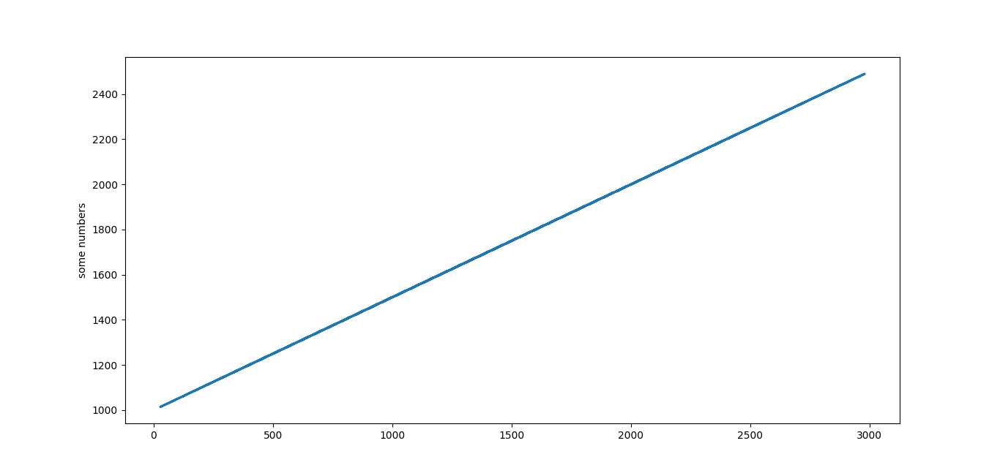

# diy_graphic_linear_regresion
this is software to graphicate a linear regresion
# you need 

numpy

matplotlib

### can install with 

    python3 -m pip install numpy
    python3 -m pip install matplotlib.pyplot

# how use
run comand

         python3 diy_linear_regression.py

and program  You will be asking for data  like

#### size of X
size of X is : size of data
#### slope
slope W : change the step in y
#### intercept 
intercept is B  : when start the line

# NOTE 
linear regresion is function with pow 1 , have a form of a line 
